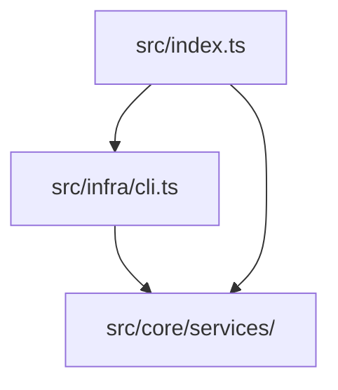
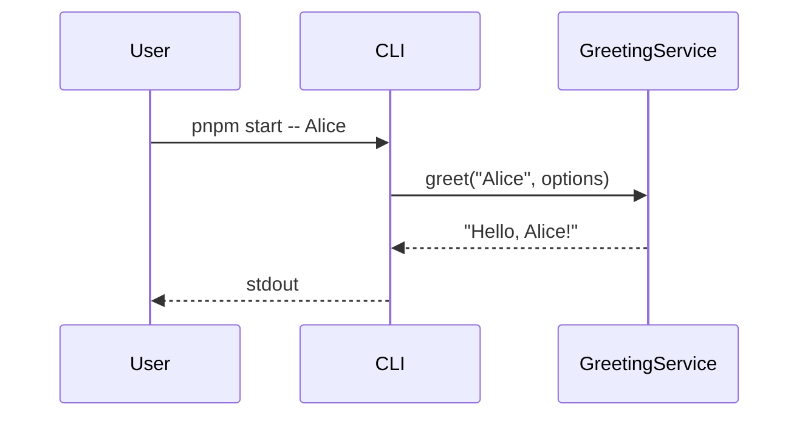
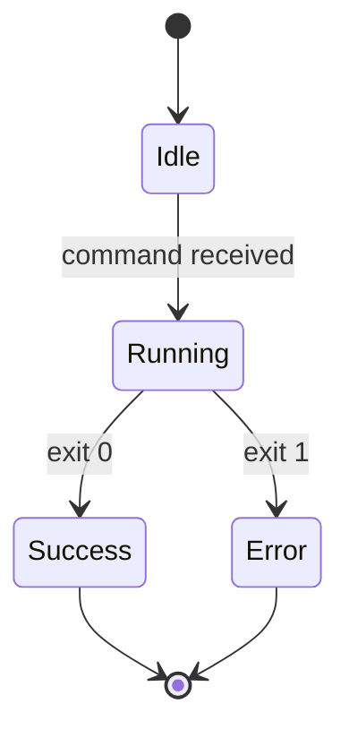

# Instruction: Mermaid Diagrams

Guidelines for creating and maintaining Mermaid diagrams in docs and specs.

## When to Use Diagrams

Create a diagram when prose would be harder to follow than a visual:
- Architecture layers and data flow
- Sequence of operations (e.g. CLI execution flow)
- State transitions
- Decision trees

Avoid diagrams for trivial structures that read clearly as text.

---

## Diagram Types

### Architecture diagram

Use `graph TD` (top-down) for layers:



### Sequence diagram

Use for operation flows:



### State diagram

Use for mode transitions:



---

## Placement Rules

- **Architecture diagrams** → `docs/agent-os/architecture.md`
- **Spec diagrams** → inside `.agent-os/specs/YYYY-MM-DD-slug/spec.md` (inline)
- **README diagrams** → `README.md` only if they aid quick understanding

---

## Formatting Rules

- Use a blank line before and after each diagram block.
- Add a one-line caption (plain text, not a heading) below each diagram.
- Keep diagrams simple — max ~10 nodes; split into two if larger.
- Do not add colour or styling unless critical for meaning.

---

## Example: Embedding in a Spec

```markdown
## Architecture

The feature follows the existing core/infra separation:

\`\`\`mermaid
graph LR
    CLI --> GreetingService
    GreetingService --> Formatter
\`\`\`

The CLI remains thin; formatting logic lives in `core/services/`.
```

---

## Testing Diagrams

Mermaid syntax can be validated by pasting into [mermaid.live](https://mermaid.live) before committing.
